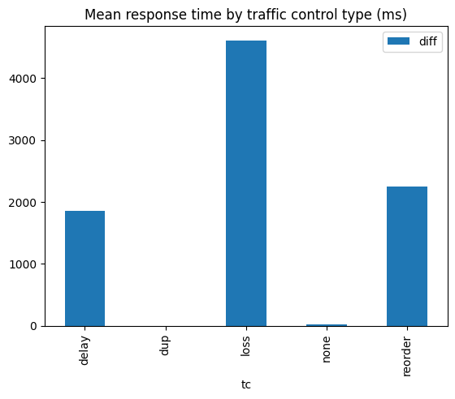
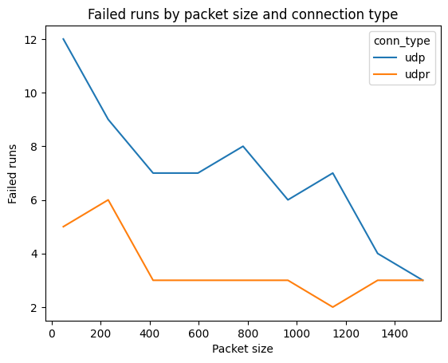
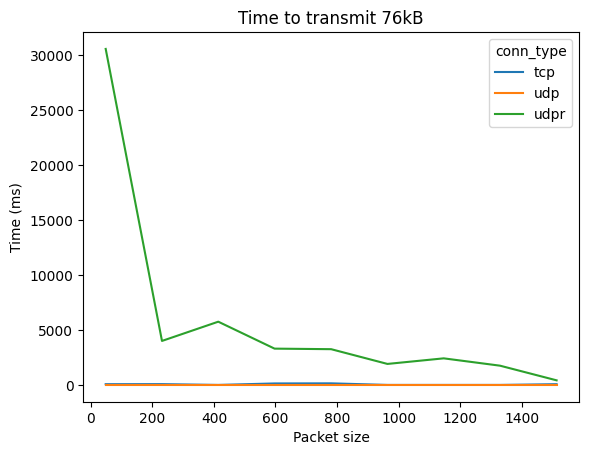
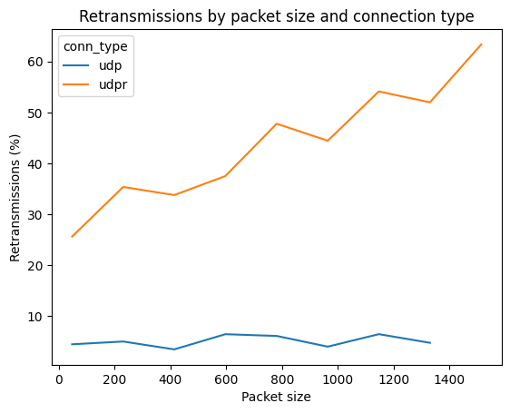

# Protokół Przesyłania Ciągów Bajtów

## Metodyka testów

Aby znaleźć optymalny rozmiar pojedynczej paczki danych przeprowadzono testy wydajnościowe dla różnych wielkości paczek. Każdy z testów przeprowadzono na tym samym pliku o wielkości 76 KB. Dla każdego z protokołów (TCP, UDP, UDP z retransmisją) wykonano po 3 powtórzeń testów z różnymi typami możliwych do wystąpienia błędów. (Połączenie doskonałe, opóźnienia, duplikacje paczek, utrata paczek, błędna kolejność paczek).

Testy były wykonywane za pomocą kontenerów Dockerowych na dwóch różnych fizycznych maszynach. Do symulacji różnych warunków sieciowych użyto narzędzia `tc`.

Aby obniżyć koszty związane z zapisywaniem wyników testów, przesyłane dane nie były zapisywane na dysku - jedynie nagłówki pakietów były zapisywane w celu analizy. Poprawność przesyłanych danych była weryfikowana za pomocą rozmiaru pliku i sprawdzeniu czy każda z paczek została przesłana.

## Wyniki testów

Na wykresie przedstawiono średni czas odpowiedzi dla różnych typów opóźnień. Warto zauważyć, że najwyższą wartość uzyskano dla utraty pakietów. Dzieje się tak z powodu konieczności retransmisji paczek, która odbywa się dopiero po upływie pewnego czasu (timeout).

Na wykresie przedstawiono ilość nieudanych transmisji w zależności od wielkości paczki.
Jak można się spodziewać, TCP nie generuje błędów. Równie oczekiwane jest to, że UDP z retransmisją generuje mniej błędów niż zwykłe UDP.

Na wykresie przedstawiono czas potrzebny na przesłanie pliku w zależności od wielkości paczki. Warto zauważyć, że im większe rozmiary paczek tym mniejszy zysk z powiększenia rozmiaru paczki (diminishing returns).

Na wykresie przedstawiono ilość retransmisji w zależności od wielkości paczki. Widać, że ilość retransmisji rośnie wraz ze wzrostem wielkości paczki.

## Wnioski

Ostatecznie wybrano rozmiar paczki wynoszący 512 bajtów. Dla tego rozmiaru paczki uzyskano najlepsze wyniki w testach wydajnościowych, gdyż jest to dobry kompromis pomiędzy czasem przesyłania danych a ilością retransmisji. Taka wartość została wybrana również ze względu na to, że większość urządzeń ma MTU ustawione na 1500 bajtów, zatem dla paczek o rozmiarze 512 bajtów nie będzie konieczne ich dzielenie.
